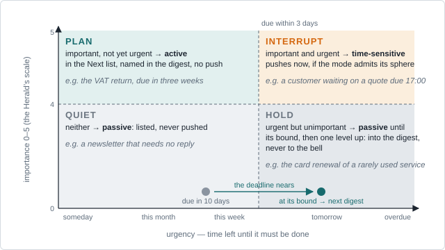
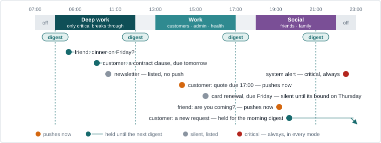
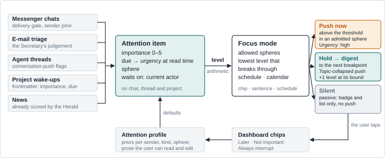
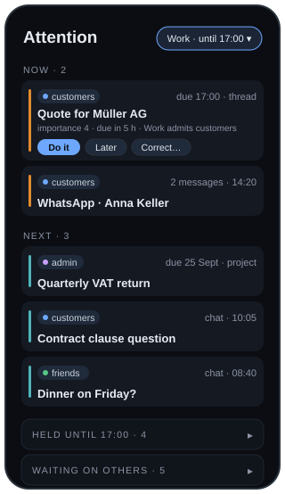

# Importance, urgency and focus on the dashboard

<p class="lede">What interruption research and notification products found, applied to Retinue’s dashboard.</p>

## 1 · The problem, and what the research says

**The dashboard knows that something arrived, not how much it matters.** Chats and threads are sorted by recency, projects alphabetically, each in its own card, and every agent turn that lands unread fans out a Web Push with a title, a body and a link — no urgency, no batching, no hours. Beyond muting and the delivery gate, the only filter is the per-device *notification mode* (new, stalled, all, off): by kind of event, never by what it is about. So the reminder to renew the card of a rarely used service arrives exactly like a customer waiting for a quote. Only the news feed ranks: the Herald scores items 0–5, the store decays them, and dated items hold full weight until they lapse — the pattern this brief generalises.

<p class="note"><small><strong>Sources.</strong> 1 — Mark, González &amp; Harris, <em>No task left behind?</em>, CHI 2005; Mark, Gudith &amp; Klocke, <em>The cost of interrupted work</em>, CHI 2008; Leroy, <em>Attention residue</em>, OBHDP 2009. 2 — Iqbal &amp; Bailey, <em>Effects of intelligent notification management</em>, CHI 2008; Horvitz, Apacible &amp; Subramani, <em>Balancing awareness and interruption</em>, UM 2005. 3 — Fitz, Kushlev et al., <em>Batching smartphone notifications can improve well-being</em>, Computers in Human Behavior 2019; Pielot &amp; Rello, <em>Productive, anxious, lonely</em>, MobileHCI 2017; Kushlev, Proulx &amp; Dunn, <em>Silence your phones</em>, CHI 2016. 4 — Mehrotra et al., <em>My phone and me</em>, CHI 2016; Fischer et al., <em>Effects of content and time of delivery</em>, MobileHCI 2010. 5 — Aberdeen, Pacovsky &amp; Slater, <em>The learning behind Gmail Priority Inbox</em>, 2010; <code>docs/news.md</code>.</small></p>

**Five findings from interruption research**, each mapped to a decision on pages 3–4:

1. **Interruptions cost more than the minutes they take.** More than half of all working spheres get interrupted; interrupted people finish faster but pay in stress, frustration and time pressure, and part of the mind stays with the old task (“attention residue”). → *Fewer, deliberate interruptions, each with a visible reason.*
2. **Timing matters as much as volume.** Notifications delivered at task boundaries (breakpoints) cause less frustration and are acted on faster than immediate ones. *Bounded deferral* adds the other half: hold it while the person is busy, but no longer than its urgency allows. → *Defer to breakpoints, with a deadline-derived bound.*
3. **Batching beats both the firehose and silence.** Batched three times a day, notifications left the 237 participants of a field experiment more attentive, more productive and calmer; switched off entirely, they raised anxiety about missing things. → *A scheduled digest, not a mute button.*
4. **Who and what predict receptivity better than when.** Willingness to attend depends mostly on the sender and the content, less on the moment. → *Filter by sphere and sender, per mode; let the user name who may break through.*
5. **Importance is personal, learnable, and must stay explainable.** Gmail’s Priority Inbox ranks mail by a per-user estimate of the chance of acting on it, corrected by explicit marks — as the Herald does for news. → *Priors per sender, kind and sphere; a reason line on every ranked item.*

<figure>
<figcaption><strong>Figure 1.</strong> Two axes, four treatments. Importance is the Herald’s 0–5; time left is read at query time. The card renewal starts quiet and, as its deadline nears, is held and then reaches the next digest — one level up, never the bell. The axes are Eisenhower’s (via Covey); the four ways to coordinate an interruption — immediate, scheduled, negotiated (announce, let the person choose the moment) and mediated (an agent chooses) — are McFarlane &amp; Latorella’s (2002). Retinue has an agent, so it can mediate: choose the moment on the user’s behalf.</figcaption>

</figure>

## 2 · Products, and five principles

<p class="note"><small><strong>Products.</strong> Apple, iOS 15 Focus, interruption levels and Notification Summary (2021); Android notification channels and Do Not Disturb; Slack notification schedules; Hey (2020): Screener, Imbox, Feed, Paper trail; Gmail Priority Inbox (2010); Allen, <em>Getting Things Done</em> (2001); Anderson, <em>Kanban</em> (2010). Retinue’s own precedents: the delivery gate (<code>docs/triage-delivery-gate.md</code>) and the news ranking (<code>docs/news.md</code>).</small></p>

Products turned the same research into a few mechanisms Retinue can borrow:

- **Levels, not one bell.** iOS gives each notification one of four interruption levels — *passive* (silent, listed), *active* (default), *time-sensitive* (breaks through a Focus), *critical* (always) — and Android’s channels carry the same idea. Only the top levels interrupt.
- **Modes as allow-lists.** A Focus mode names the people and apps that may break through, by schedule or by hand; Slack’s notification schedule and calendar focus blocks do the same at work. “Customers during work time, friends during social time” is a mode.
- **A scheduled summary.** iOS’s Notification Summary delivers the held remainder at set times, ranked by relevance — the batching study, productised.
- **Screen the unknown.** Hey asks once per first-time sender; Retinue’s delivery gate already does this, and the design builds on it.
- **Sections by treatment, not by source.** Gmail’s *Important · Starred · Everything else* and Hey’s *Imbox · Feed · Paper trail* replace one list with a few that mean different things; GTD adds a *waiting for* list for what is parked on others, and Kanban caps work in progress so the active list stays short.

**Five principles for Retinue** follow:

1. **One attention model.** To the user a chat, a thread and a project are the same kind of thing: something that wants attention, with an importance, a deadline, a sphere and someone it waits on. Storage stays separate; the dashboard shows the union.
2. **Interrupt by level, not by arrival.** Only *time-sensitive* and *critical* items push at once. *Active* items wait for the next breakpoint; *passive* ones are listed and never push.
3. **Modes are allow-lists per sphere, with a threshold.** *Work*: customers, admin and health break through, friends wait; *Social*: the reverse; *Deep work* and *Off*: only critical, the digest waiting for the morning.
4. **Defer with a bound.** A held item’s deadline sets how long it may wait; when the bound expires it climbs one level, never above *active* if it is unimportant — the card renewal reaches the digest, not the bell. Breakpoints are mode changes plus fixed digest times, three a day by default (Figure 2).
5. **Learn, explain, keep the override.** Chips on every item feed priors; every ranked item shows a one-line reason, as the news feed does; a wrong call is corrected with one tap.

<figure class="wide">
<figcaption><strong>Figure 2.</strong> One weekday. The mode band says who may break through; held items (bars) wait for the next digest at a breakpoint — a mode change or a fixed time (the batching study’s 9 / 15 / 21 h) — and a held item’s deadline bounds the wait. Spheres and hours are examples; each deployment names its own.</figcaption>

</figure>

## 3 · Recommendation: item, mode, delivery

<p class="note"><small><strong>Today’s knobs stay.</strong> The per-device <code>notification_mode</code> (<code>push_notify.py</code>), <code>muted</code> on threads and chats, and the delivery gate’s whitelist all keep working; the mode wraps them. Web Push headers per RFC 8030: <code>Urgency</code> (very-low … high), <code>Topic</code> (a new push replaces a pending one with the same topic), <code>TTL</code> — today only the TTL is set.</small></p>

**The item.** All three entities get the same four properties in the `kb:` vocabulary, set where each is created:

| Property | Values | Set by |
|---|---|---|
| `kb:importance` | 0–5, the Herald’s scale; unset counts as 2.5 | `--importance` on `conversation-push.py`, the Secretary in triage, frontmatter, a sender prior |
| `kb:due` | `xsd:dateTime`; urgency is the time left, read at query time | `--due`, `expected_by` / `next_due`, a date the Secretary extracts |
| `kb:sphere` | one of a small set the deployment names | chamber instructions, contact groups, frontmatter |
| `kb:currentActor` | who holds the ball; today only on projects | already there |

```turtle
conv:8f2c…  kb:importance 4 ;  kb:sphere sphere:customers ;
    kb:due "2026-09-04T17:00:00+02:00"^^xsd:dateTime ;
    kb:currentActor actor:reto .
```

Threads and chats keep their JSON stores, emitted into `_generated/`; projects gain frontmatter keys. One free `SELECT` — what wants attention now, at which level — serves dashboard and scheduled jobs alike.

**The level** is arithmetic — no model turn; *critical* is never derived, only declared (a system alert, a contact the user marked *always*):

| | no deadline, or > 3 days | ≤ 3 days | ≤ 24 h, or overdue |
|---|---|---|---|
| importance 4–5 | active | time-sensitive | time-sensitive |
| importance 2–3 | passive | active | active |
| importance 0–1 | passive | passive | active |

**The mode** is one small document the gateway keeps (`focus.json`, mirrored into the store): name, allowed spheres, the lowest level that breaks through, a schedule, optionally a calendar rule. It is set by a chip in the dashboard header, a sentence to Ara (“work mode until 17:00”), a schedule or a calendar block titled *Focus*; every delivery decision reads it, nothing else needs to know it exists.

**Delivery** (Figure 3). An item at or above the mode’s threshold, in an admitted sphere, pushes at once with `Urgency: high`. Everything else waits for the next breakpoint, where one `Topic`-collapsed digest push lists the held items by level and importance; passive items never push. Two negotiated interruptions: a whitelisted sender who writes again within five minutes gains a level (the phone’s repeated-caller rule), and where the send policy allows, the Secretary may tell a held sender when the message will be seen. *Off* is the quiet-hours mode: only critical passes; the morning digest opens the day.

<figure>
<figcaption><strong>Figure 3.</strong> From arrival to delivery. Every source sets the same four properties; the level is arithmetic; the mode filters; three outcomes. The dashboard’s chips feed an attention profile that supplies defaults next time. No model turn is spent on delivery.</figcaption>

</figure>

## 4 · The streamlined dashboard, rollout, measures

<figure class="phone">
<figcaption><strong>Figure 4.</strong> The home screen as one list, in the dashboard’s existing palette. Stripe = level, chip = sphere, meta = deadline or channel.</figcaption>

</figure>

**One list, four sections** replaces the three competing cards as the home screen. **Now**: what may interrupt under the current mode, capped at a handful. **Next**: important, not yet urgent. **Held**: collapsed — *n* items until the next breakpoint, with its time. **Waiting on others**: parked on agents or people, with the age. Each row shows its sphere, its level as a stripe, who holds it and the deadline; the reason line says why it ranks. The chats, conversations and projects pages remain as drill-downs. Three chips do the learning: **Later** (to the next breakpoint, or tomorrow), **Not important** (lowers the prior for this sender or kind), **Always interrupt** (raises it and adds the sender to the mode’s allow-list). The mode chip in the header always shows what is being filtered, so nothing is hidden silently.

**Rollout in three slices**, each useful alone:

1. **Fields and the list.** The four properties, the level table, the Attention list, the manual mode chip; badges and pushes obey the mode. No learning, no digest yet — and most of the value. Touches `web-gateway.py` (an `/attention` route), `conversation-push.py`, `push_notify.py`, and one `attention.js` in place of three cards.
2. **Deferral.** Digests at breakpoints, `Urgency` and `Topic` headers, deadline bounds, schedules and quiet hours, the repeated-sender rule.
3. **Learning.** Priors from the chips and from the Secretary’s triage judgement, kept in an *attention profile* the user can read and edit, as `preferences.md` is for news; calendar-driven modes; Secretary replies to held senders.

**Measure** pushes per day by level, time from arrival to action for time-sensitive items, digest open rate, and two error rates — *Not important* on an item that pushed (a false alarm), *Always interrupt* on one that was held (a miss). Tune the digest times and the *Now* cap from these.

**Risks.** Over-filtering hides a real emergency: the bound, the undeferrable critical level and the existing daily catch-all keep that bounded. Complexity: four levels, one small sphere set, four named modes — no sliders. Cost: the level is arithmetic; the only model judgement is the Secretary’s, which triage spends already. The defaults proposed here — spheres, allow-lists, digest times — are assumptions; record them as memories when adopted, so later sessions inherit them.

**Decisions to take before slice 1.** The sphere set and the four mode names; which spheres each mode admits by default; the digest times; whether the Attention list replaces the three cards or sits above them; and whether the Secretary may answer held senders at all. Each becomes a memory once decided.
